# 🧠 AWS Bedrock 任務報告 - 鍵盤說明書聊天機器人

## 📘 專案簡介

本專案展示如何使用 **Amazon Bedrock** 的平台功能，建構一個文件問答應用系統。  
使用者可查詢「鍵盤產品使用說明書」中的功能、設定方式與注意事項，系統將自 Knowledge Base 擷取資訊並以 **Claude 3 Haiku**模型生成回答。

---

## 🎯 任務目標

- 熟悉 AWS Bedrock 的服務與操作流程
- 透過 Web UI 完成知識庫建置與模型設定
- 上傳鍵盤產品說明書，建立 Retrieval-Augmented Generation (RAG) 應用
- 以 Python 呼叫 Bedrock API
- 開發完整 API：將 Bedrock 模型封裝為 RESTful API，供前端或其他服務使用
- 進行 prompt engineering 與模型調優

---

## ⚙️ 技術架構說明

- **模型服務**：Anthropic Claude 3 Haiku（Amazon Bedrock 模型）
- **知識庫來源**：上傳至 S3 的鍵盤說明書（.pdf）
- **Chunking Strategy**：Semantic
- **Embedding Model**：Cohere Embed Multilingual V3
- **向量資料庫**：Amazon OpenSearch Serverless
- **操作方式**：全程透過 AWS Console 設定與操作

架構示意：
```
使用者提問 → 查詢 KB → Claude 模型回覆答案
```

---

## 🧾 操作流程紀錄

### 1. 模型試用與 Console 環境熟悉

- 進入 [AWS Bedrock Console](https://console.aws.amazon.com/bedrock/)
- 使用 Claude 3 Haiku 測試簡單聊天與摘要功能（Playground）

**📸 模型 Playground 測試畫面**
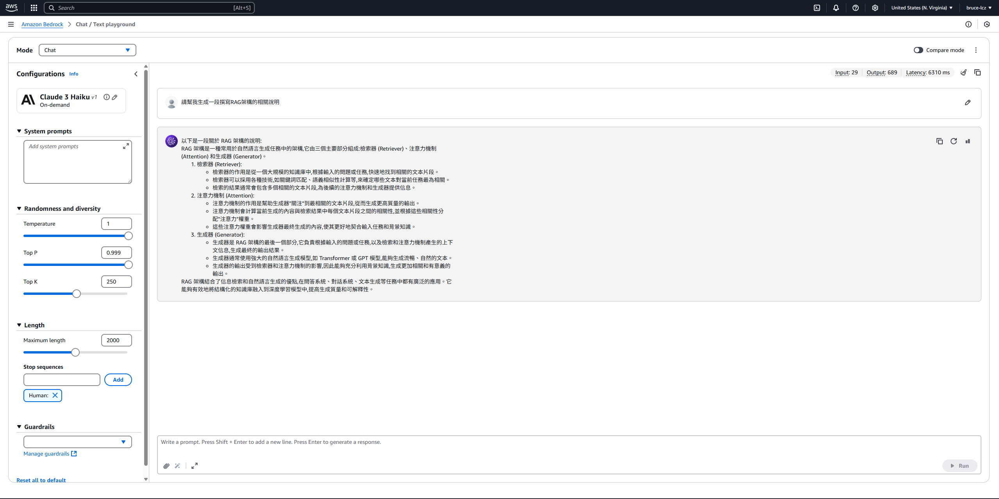

---

### 2. 文件上傳至 S3

- 建立 Bucket：`my-keyboard-docs`
- 上傳鍵盤產品使用說明書（`g915_x_lightspeed_qsg_amr.pdf`, `IRK59M 中英說明書 電子版 20211214.pdf`）

**📸 bucket建立畫面**
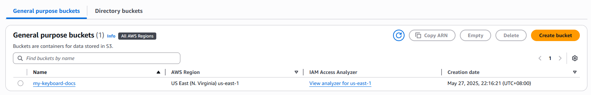

**📸 S3 上傳完成畫面**
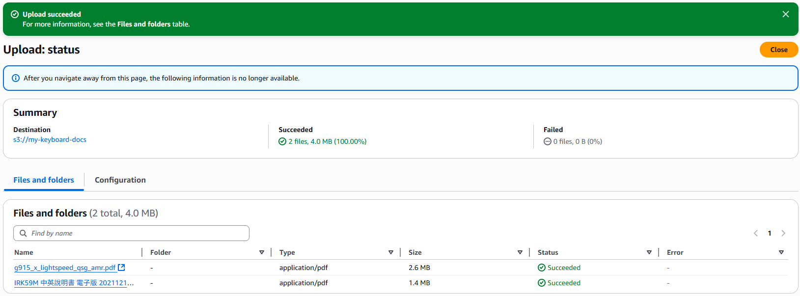
---

### 3. 建立 Knowledge Base

- 使用 AWS Console 建立 KB：
    - 來源：S3 中的文件
    - Chunking：Semantic
    - Embedding：Cohere Multilingual V3
    - 向量儲存：OpenSearch Serverless

**📸 Knowledge Base 設定細節畫面**

<br>

---

為了建立Knowledge Base，過程中遇到一些Permission上的錯誤，如OpenSearch Serverless相關、IAM <br>
➔ 熟悉IAM user/user-group的建立，並得知了有分root/role的機制，也一併解決，開啟的permissions如下圖。

---

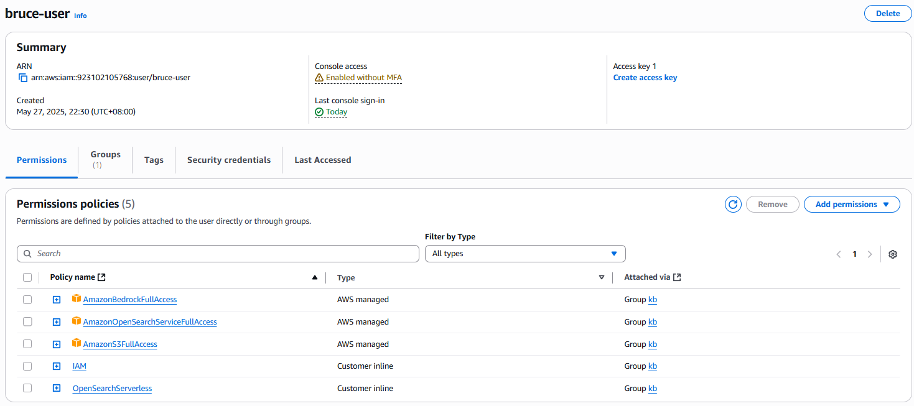
<br>
以下為建立KB成功畫面:

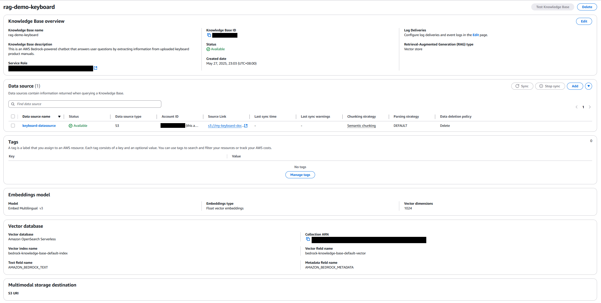

---

### 4. 啟用聊天應用（Retrieve & Generate）

- 測試 KB 功能：輸入問題 → Claude 根據 KB 回答

**📸 問題與模型回答結果畫面**
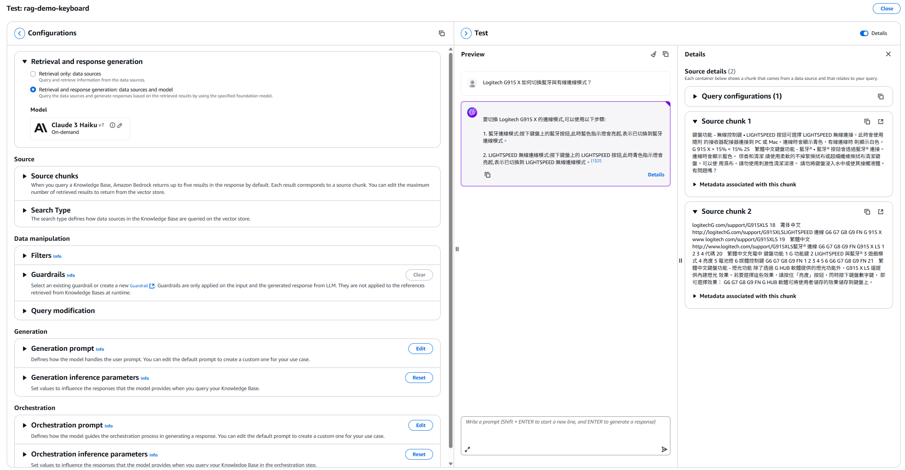

**📸 於UI設置System Prompt:**
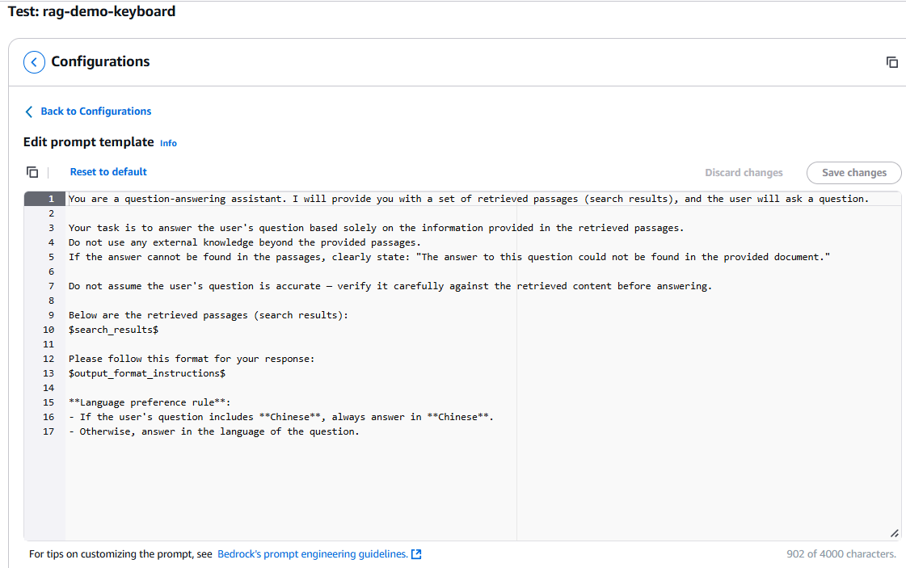
---

## 🧪 測試案例與模型回答（展示 Knowledge Base 功能）

| 題號 | 測試問題                                       | 預期標準答案                                                                          | 是否符合預期  |
| -- | ------------------------------------------ | ------------------------------------------------------------------------------- | ------- |
| [Q1](#q1) | **Logitech G915 X 如何切換藍牙與 LIGHTSPEED 模式？** | 使用者可透過鍵盤右上方的 Bluetooth 鍵與 LIGHTSPEED 鍵切換模式。藍色為 Bluetooth 模式，青綠色為 LIGHTSPEED 模式。 | ✅ 是 ☐ 否 |
| [Q2](#q2) | **i-Rocks IRK59M 鍵盤要如何恢復出廠設定？**            | 按下 Fn + Esc 持續 3 秒，即可清除所有巨集與背光設定，恢復預設值。                                         | ✅ 是 ☐ 否 |
| [Q3](#q3) | **G915 X 可以儲存幾組板載巨集設定？怎麼切換？**              | 可儲存 3 組設定檔。透過 Fn + F1/F2/F3 來切換，或使用 Logitech G HUB 軟體操作。                        | ✅ 是 ☐ 否 |
| [Q4](#q4) | **IRK59M 是否可以在無需軟體的情況下錄製巨集？**              | 是的，IRK59M 支援硬體錄製巨集。使用 Fn + M1\~M4 鍵開始錄製，再次按下停止錄製。                               | ✅ 是 ☐ 否 |
| [Q5](#q5) | **請問 G915 X 的電量低時會有什麼燈號提示？**               | 電量低於 15% 時，電源 LED 燈會亮起紅燈，提醒使用者需要充電。                                             | ✅ 是 ☐ 否 |


### Q1:
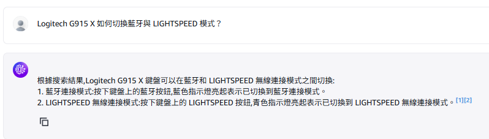<br>
### Q2:
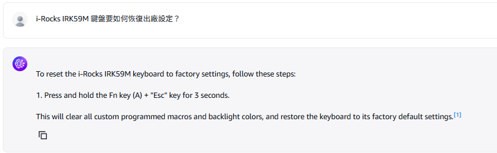<br>
### Q3:
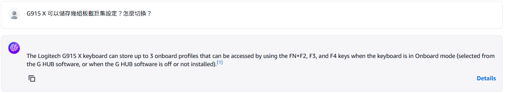<br>
### Q4:
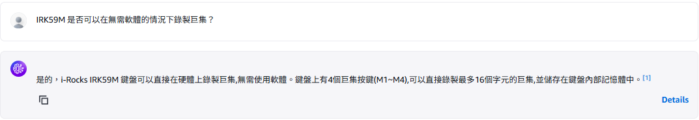<br>
### Q5:
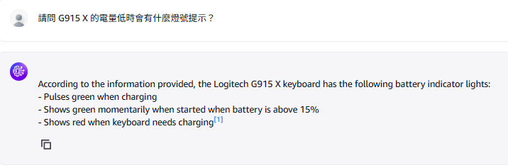<br>
---

## 🧪 延伸練習（Python 呼叫 Bedrock）

雖主要操作為 UI，但我也嘗試以 Python + boto3 呼叫 `retrieve_and_generate()` API：
如檔案 **demo.py**

**📸 地端透過boto3呼叫 Bedrock **
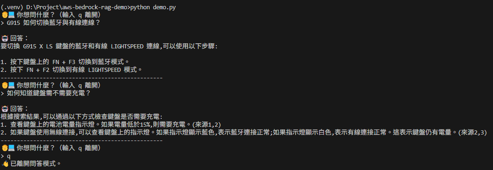

✅ 證實可從地端程式查詢 KB 並取得 Claude 回覆。

## 📎 附件清單
`g915_x_lightspeed_qsg_amr.pdf`, `IRK59M 中英說明書 電子版 20211214.pdf`：鍵盤說明書原始檔

`screenshots/*.png`：操作畫面截圖（S3、KB 設定、模型回覆）

`demo.py`：Python 呼叫範例

## 完成項目與Follow-ups @05/27

- ✅ 熟悉 AWS Bedrock 的服務與操作流程
- ✅ 透過 Web UI 完成知識庫建置與模型設定
- ✅ 上傳鍵盤產品說明書，建立 Retrieval-Augmented Generation (RAG) 應用
- ✅ 以 Python 呼叫 Bedrock API
- ☐ 開發完整 API：將 Bedrock 模型封裝為 RESTful API，供前端或其他服務使用
- ☐ 進行 prompt engineering(Few-shot) 與模型(Chunking)調優
